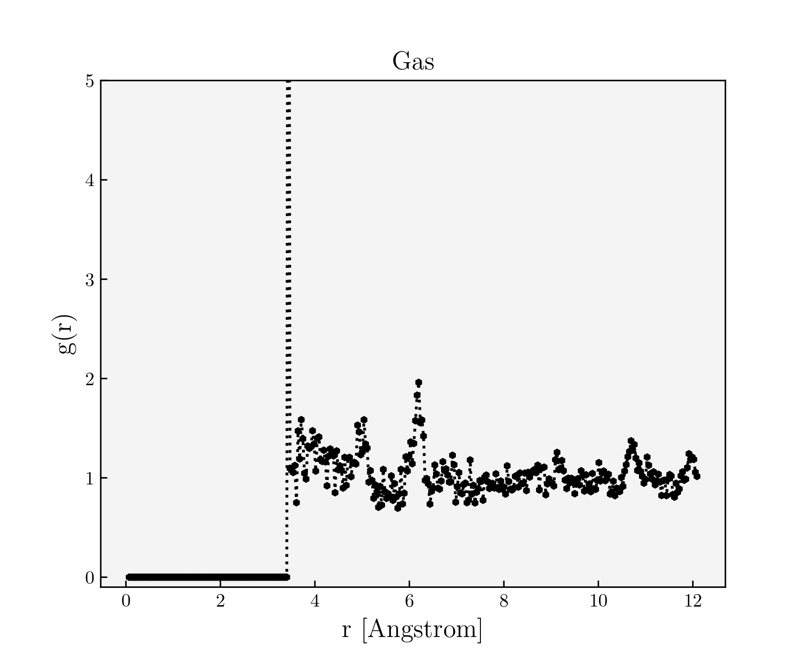
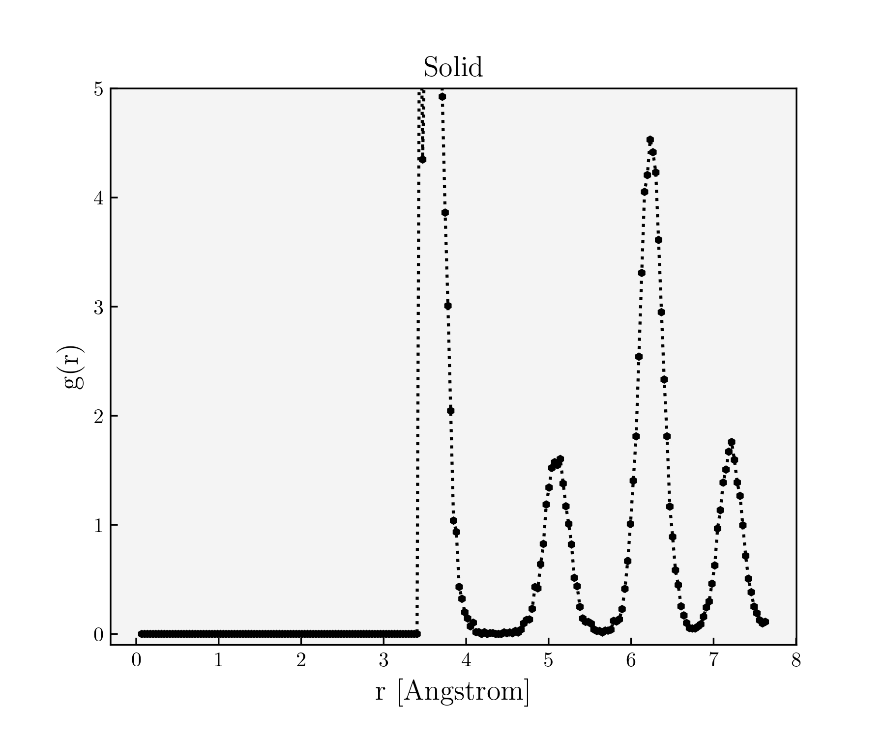
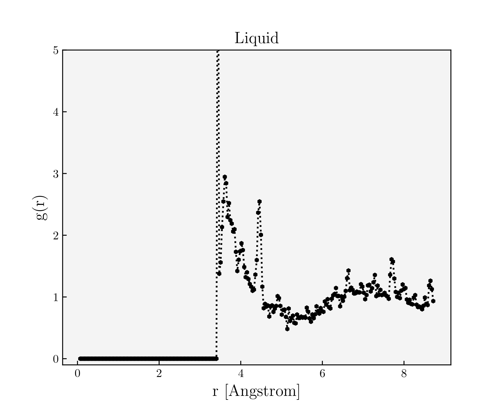

# Computational Physics: Molecular Dynamics

**Authors**: Konstantinos Kilmetis and Diederick Vroom

This code was made to simulate Argon atoms at different states of matter by changing initial densities and temperatures. The atoms are simulated to be in a pseudo-infinite box by implementing the Minimal Image Convention.

Forces are calculated using the Lennard-Jones potential: $V(r)=4\varepsilon\left[\left(\frac{r}{\sigma}\right)^{12} - \left(\frac{r}{\sigma}\right)^{6} \right]$, where $\varepsilon$ and $\sigma$ are constants, dependent on the used element. For Argon $\varepsilon = 119.8\ \mathrm{K}$ and $\sigma = 3.405\ \mathrm{Å}$. The argon atoms start off in a Face-Centred Cubic configuration, as if in a solid state. Dependent on the initial density and pressure, the simulation is run to equilibrate into a new configuration, which resembles the phase of matter identified by the inputted initial density and temperature. From then onwards the atoms are free to move and interact.

This code was created for Project 1: Molecular Dynamics of the MSc course "Computational Physics" at Leiden University, year 2024.

## How to Use

### Running a simulation

Running a simulation consists mainly of two steps:

* Setting the initial conditions in `config.py`
* Running `simulation.py`

#### Setting initial conditions

`config.py` is the file where all the initial conditions are set. In this file one can set the number of atoms in the simulation (`Nbodies`), the time period (in picoseconds) over which the simulation is run (`time`), the size of the timestep (`timestep`) (in picoseconds), wether to print progress in the terminal (`loud`), and wether to plot the current configuration during the simulation.

`config.py` also contains an additional parameter, `state_of_matter`, which represent the phase of the Argon atoms. Setting this parameter to either `Solid`, `Liquid`, or `Gas`, makes it so that the simulation uses the default values set in the `if`-statements within `config.py`. These default values are known to correspond to the respective phase of matter. Setting `state_of_matter` to `Custom` allows you to insert your own custom initial density and temperature, at the very last `if`-statement within `config.py`.

For more details, see the documentation in `config.py`.

#### Running the simulation

Running the simulation is fairly straightforward. After having set the parameters within `config.py` simply run `simulation.py` to run the simulation.

```bash
python 'simulation.py'
```

If `loud=True`, several snippets will be printed in the console during the simulation process, showcasing the progress of the simulation. One of the first steps the simulation performs is to "equilibrate" the Argon atoms, this way they are closer to the desired matter state. During the equilibration process several snippets will be printed in the terminal, with a general structure that looks somewhat like this:

```
Our Kinetic energy | Target
---------------------------
46.88916960436301  | 80.25
Not in Equilibrium
47.012377940909495 | 80.25
lambda 1.3065210495643331
29.1567868999961   | 80.25
System in Equilibrium
80.99557491500724  | 80.25
```

(for initial `density=0.5, temperature=0.5, time=10, timestep=0.001, Nbodies=108`)
The two number separated by the "|" character indicate total kinetic energies of the system, with the left number the measured kinetic energy of the system, and the right number the target kinetic energy of the system. During the equilibration process the velocities of the Argon atoms are rescaled iteratively such that eventually the total measured kinetic energy is within 5% of the target kinetic energy, at which point the system is in equilibrium. The rescaling factor is `lambda` ($\lambda$), which is also printed each iteration. After the equilibration process is complete, the real simulation begins. From then onwards progress will be periodically printed in the console as a percentage.

Finally, after the simulation is completed, the calculated final pressure of the system is printed, together with an estimated standard deviation on this value.

**Note:** For initial densities and temperatures corresponding to a solid state of matter, the equilibration process can take a very long time if `timestep` is too big. Make sure it is small enough. From experience we have found that `timestep=0.001` works well.

### Outputs

After the simulation is finished, several outputs will be produced.

The first thing to be made (even before the simulation starts) is a new folder within the `\sims\` directory (make sure this exists!), inside the current working directory, this new folder is unique to the current simulation. The name of which is automatically generated and follows the structure `"{config.state_of_matter}_at_{day}-{Month}-{Hour}:{Minute}:{Second}"`. Example: `"Gas_at_19-Mar-15:34:55"`, with the time in the folder name being the time of creation and the matter state corresponding to `state_of_matter` inside `config.py`.

Inside the newly created folder within `\sims\` several files will be produced once the simulation is finished:

* `energy_err.pdf`: This file is a plot showcasing the energy of the system over time.
* `pair_corr.pdf`: This file is a plot showcasing the pair correlation function of the system over distance.
* `params.txt`: This file contains `config.temperature`, `config.density`, and the calculated `pressure` and corresponding standard deviation.

#### Example outputs

Example `energy_err.pdf` image for a Gas configuration


Example `pair_corr.pdf` image for a Gas configuration. The most notable feature being that the function plateaus to a value of 1.



Example `pair_corr.pdf` image for a Solid configuration. The most notable feature being the periodic spikes in the function.



Example `pair_corr.pdf` image for a Liquid configuration. The pair correlation plot for a liquid state is usually identifiable by having features of both Gas and Solid pair correlation plots.




#### Other Files

While the user only has to interact with `config.py`, the rest of the constituent parts of the code are summarized here.

1. `Atom.py` contains the `Atom` class, which evolves each Argon atom in the simulation.
2. `Particles.py` generalizes the `Atom` class to a collection of Argon atoms and hosts QoL functions.
3. `simulation.py` is the main file which runs the simulation. Running this file runs a simulation, with the initial values written in `config.py`.