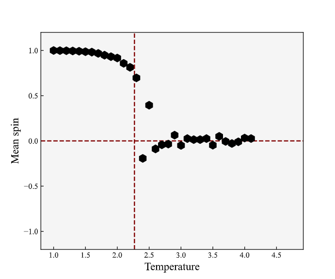
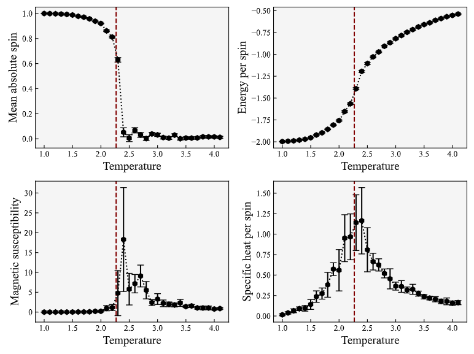

# Computational Physics: The Ising Model

**Authors**: Konstantinos Kilmetis and Diederick Vroom

This code was made as a Monte-Carlo Markov-Chain implementation of the 2D Ising Model for different initial temperatures, grid sizes, spin-coupling constant $J$, and external magnetic field $H$. The 2D grid of spins is simulated to be of pseudo-infinite size by periodic boundary conditions.

Throughout the simulation, the grid is guided towards a state of minimum energy, as per the Hamiltonian $\mathcal{H} = -J\sum_{\langle i,j\rangle} s_is_j - H\sum_is_i$, via the Metropolis-Hastings algorithm.

This code was created for Project 2: The Ising Model of the MSc course "Computational Physics" at Leiden University, year 2024.

## How to Use

### Running a simulation

Running a simulation consists mainly of two steps:

* Setting the initial conditions in `config.py`
* Running `simulation.py`

#### Setting initial conditions

`config.py` is the file where all the initial conditions are set. In this file one can set the following base parameters:

* `temperature`: The temperature at which the simulation is run.
* `Nsize`: The grid-size of the simulation.
* `MC_steps`: The maximum number of steps the simulation is run for in Monte-Carlo steps.
* `buffer`: The number of MC-steps the simulation continues to run after the system has equilibrated.
* `J_coupling`: The value of the spin-coupling constant $J$.
* `H_ext`: The strength (and direction) of an external magnetic field $H$.

`config.py` also contains some Quality of Life parameters:

* `rngseed`: The seed used for randomly generating a grid. Note: does **not** influence if the Metropolis-Hastings algorithm transitions to a higher energy state.
* `loud`: Wether to print progress in the terminal or not.
* `kind`: What kind of simulation you're running; for a single temperature or a range of temperatures.
* `init_grid`: Which initial grid to use; a 75% positive-spin grid, or a fully random grid.
* `simname`: The name of the simulation, used for saving results. Defaulted to `/{init_grid}_{kind}_at_{time_of_initialization}/`.

Lastly, `config.py` contains the `temperatures` (plural) parameter. This is a list (or array) of temperatures used when simulations are run for a range of temperatures. Make sure to set `kind = 'sweep'` when desired to do so.

For more details, see the documentation in `config.py`.

#### Running the simulation

Running the simulation is fairly straightforward. After having set the parameters within `config.py` simply run `simulation.py` to run the simulation.

```bash
python3 'simulation.py'
```

If `loud = True`, progressbars from the `tqdm` package will appear in the terminal at time-intensive steps of the simulation; namely when running the Metropolis-Hastings algorithm, when calculating the autocorrelation time(s) ($\tau$), and when running the Metropolis-Hastings algorithm for $160\tau$ steps to get good measurements for the observables. These will especially be visible when running for multiple temperatures (`kind = 'sweep'`).

### Outputs

Depending on the kind (`kind = 'single'` or `'sweep'`) of simulation run, different outputs will be produced.

#### Outputs for `kind = 'single'`

For a simulation run for a single temperature, 2 outputs will be produced:

* `mean_spins_and_energies_after_eq.csv`: Contains a `2 x (buffer*Nsize**2)`-sized array storing the energy $E$ for each step in the first row and the mean-spins $m$ after equilibration for each step in the second row.
* `results.txt`: Contains the main results of the simulation, in addition to the inputted initial conditions.

`results.txt` has the following structure:

```
# Inputted parameters
temperature = 3
Nsize       = 30
MC_steps    = 10000
buffer      = 100
J_coupling  = 1
H_ext       = 0

# Results
Auto-correlation time (tau): 5793 ± 10
mean absolute spin: 0.02 ± 0.01
energy per spin: -0.81 ± 0.01
magnetic susceptibility: 3 ± 1
specific heat susceptibility: 0.4 ± 0.1
```

Where the entries below `# Inputted parameters` correspond to the values given in `config.py` and the entries below `# Results` correspond to the calculated autocorrelation time $\tau$, mean absolute spin $\langle | m|\rangle$, energy per spin $e$, magnetic susceptibility $\chi_M$, and specific heat susceptibility $C$, along with their estimated standard deviations.

#### Outputs for `kind = 'sweep'`

Due to simulations being run for multiple temperatures when `kind = 'sweep'`, more output files are generated. The following `.csv` files are generated:

* `energies_after_eq.csv`: Contains a `(buffer*Nsize**2) x len(temperatures)`-sized array, with each column corresponding to a temperature showing the energy after equilibration for each simulation step.
* `final_mags_and_temps.csv`: Contains a `len(temperatures) x 3`-sized array, with the first column corresponding to `temperatures`, the second to the final mean spin $m$, and the third gives in the simulation equilibrated or not, with 1 corresponding to it having equilibrated, and 0 to not.
* `mean_spins_after_eq.csv`: Contains a `(buffer*Nsize**2) x len(temperatures)`-sized array, with each column corresponding to a temperature showing the mean spin after equilibration for each simulation step.
* `Observables.csv`: Contains a `len(temperatures) x 10`-sized array, with each set of two columns corresponding to an observable and its standard deviation for each simulated temperature. The first two columns correspond to the autocorrelation time $\tau$ and its standard deviations.

For `kind = 'sweep'`, two `.pdf` files are also generated:

* `eq_mags.pdf`: Contains a final mean spin versus temperature plot, which (should) show the classic 'pitchfork' shape if everything was done correctly.
* `main_result.pdf`: Contains 4 plots, each showing an observable versus temperature, including the standard deviations as errorbars.

#### Example Outputs

Example mean spin versus temperature plot. The vertical maroon line indicates the critical temperature $T_\mathrm{c} = \frac{2J}{\ln(1+\sqrt{2})} \approx 2.269185\ J$.



Example figure showing all the 4 observables for each temperature. Like previously, the vertical maroon line indicates the critical temperature $T_\mathrm{c}$.



## Other Files

While the user only has to interact with `config.py`, the rest of the constituent parts of the code are summarized here.

1. `functions.py` contains functions used to calculate the Hamiltonian, perform the Metropolis-Hastings algorithm, find the autocorrelation time, and calculate observables.
2. `plotters.py` contains two plotting functions used in generating the figures outputted when `kind = 'sweep'`.
3. `prelude.py` contains some basic setup run before the simulation(s) start(s).
