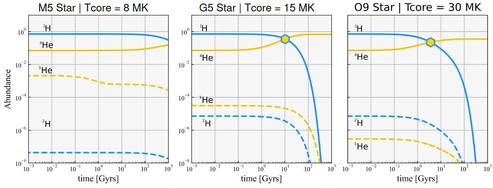
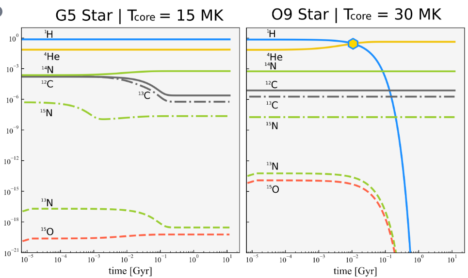
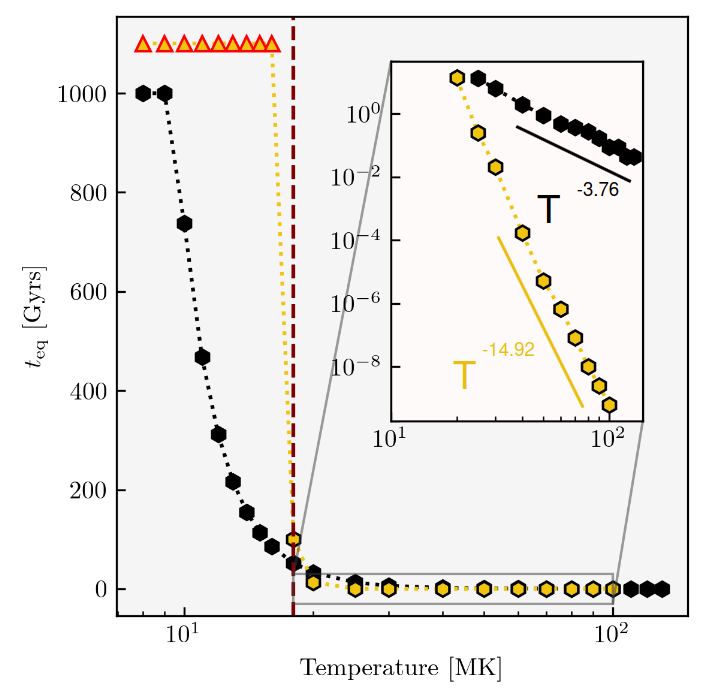
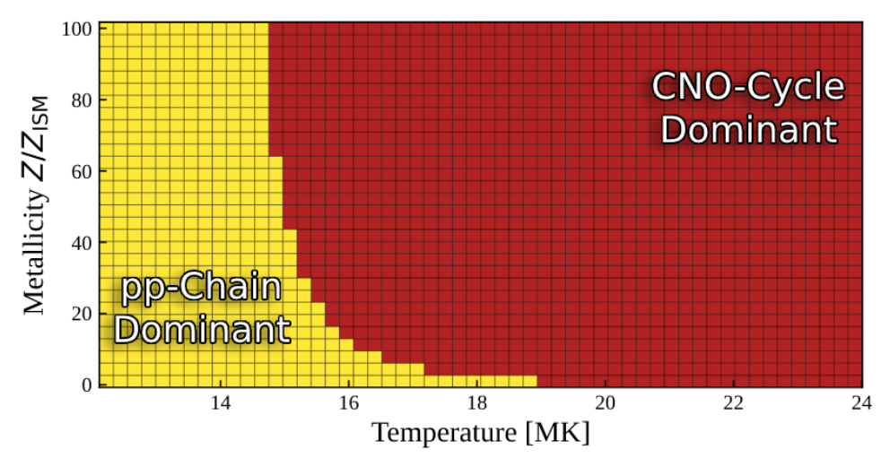

# Computational Physics: Nuclear-Reaction Network

**Authors**: Konstantinos Kilmetis and Diederick Vroom

This code was made to simulate nuclear processes involving Hydrogen-burning (H-burning) occurring in the cores of stars, resulting in the production of Helium (He). In particular, we focussed on simulating the proton-proton chain (pp-chain) and the Carbon-Nitrogen-Oxygen cycle (CNO-cycle). Our main resource for going about this was the 2017 paper by Lippuner and Roberts, titled "SkyNet: A Modular Nuclear Reaction Network Library". 

At its core, our code solves a series of coupled non-linear differential equations, which are set by the reactions occurring in the pp-chain and CNO-cycle. These equations encode the change in abundances for each element occurring in the reaction-network, over each reaction in the network. These equations were solved using the implicit Euler method for integration and the Newton-Raphson method for root finding.

This code was created for Project 3: Nuclear-Reaction Network of the MSc course "Computational Physics" at Leiden University, year 2024.

## How to Use

### Running a simulation

Running a simulation consists mainly of two steps:

* Setting the initial conditions in `config.py`
* Running `simulation.py`

#### Setting initial conditions

`config.py` is the file where all the initial conditions are set. In this file one can set the following base parameters:

* `temperature`: The core temperature of the star at which the simulation is run.

* `metallicity`: The metallicity with respect to the InterStellar Medium (ISM) value at which the simulation is run.

* `cycle`: Which nuclear reaction network to use, either the pp-chain or CNO-cycle.

* `init_abunds`: The initial abundances to use in the simulation. Can be preset ISM abundances, ISM abundances with a different metallicity, or custom abundances.

* `init_step`: The initial size of the timestep in years.

* `max_step`: The maximum size of the timestep in years.

* `max_time`: The maximum number of steps the simulation is run for in yearsa.

`config.py` also contains the following Quality of Life parameters:

* `loud`: Wether to print progress in the terminal or not.

* `kind`: What kind of simulation you're running; for a single temperature and metallicity, a range of temperatures and constant metallicity, or a range of temperatures and metallicities.

* `simname`: The name of the simulation, used for saving results. Defaulted to `/{kind}_at_{time_of_initialization}/`.

Lastly, `config.py` contains the `temperatures` and `metallicities` (plural) parameters. These are used when running simulations for ranges of temperatures and/or metallicities. Make sure to set `kind = 'equality time'` or `kind = 'dominance'` when desired to do so.

For more details, see the documentation in `config.py`.

#### Running the simulation

Running the simulation is fairly straightforward. After having set the parameters within config.py simply run simulation.py to run the simulation.

```bash
python3 'simulation.py'
```

If `loud = True`, progressbars from the `tqdm` package will appear in the terminal at time-intensive steps of the simulation; namely when simulating over ranges of temperatures and/or metallicities. (`kind = 'equality time'` or `kind = 'dominance'`).

### Outputs

Depending on the kind (`kind = 'single'`, `'equality time'`, or `'dominance'`) of simulation run, different outputs will be produced.

#### Outputs for `kind = 'single'`

For a simulation run for a single temperature and metallicity, 2 outputs will be produced:

* `pp_evol.csv` or `cno_evol.csv`: Contains an array storing the times at which the abundances were saved in the first column, in seconds, and the abundances themselves in the other columns. Number of columns is dependent on which reaction network was run; 4+1 columns for the pp-chain, 8+1 for the CNO-cycle. 

* `pp_evol.pdf` or `cno_evol.pdf`: Contains a plot showing the time-evolution of the abundances calculated during the simulation. 

#### Outputs for `kind = 'equality time'`

For a simulation run for a range of temperatures and a constant metallicity, 1 output will be produced:

* `t_eq_diagram.pdf`: Contains a plot showing the ${}^{1}\mathrm{H}$-${}^{4}\mathrm{He}$ equality time as a function of temperature for both the pp-chain and CNO-cycle.

#### Outputs for `kind = 'dominance'`

For a simulation run for a range of temperatures and a range of metallicities, 3 outputs will be produced:

* `pp_equality_times.csv`: Contains an array with the first column corresponding to the different metallicities used in the simulation and the other columns corresponding to the equality times for the pp-chain. The used temperatures are displayed in the header.

* `cno_equality_times.csv`: Contains an array with the first column corresponding to the different metallicities used in the simulation and the other columns corresponding to the equality times for the CNO-cycle. The used temperatures are displayed in the header.

* `dominance_diagram.pdf`: Contains a plot showing which reaction network dominates for which temperature and metallicity.

#### Example Outputs

Example plots generated from pp-chain simulations for different star-types. 


Example plots generated from CNO-cycle simulations for different star-types. 


Example plot showing the ${}^{1}\mathrm{H}$-${}^{4}\mathrm{He}$ equality time as a function of temperature for both the pp-chain and CNO-cycle.
Yellow is the CNO-cycle, while black is the pp-chain. The triangles indicate a lower limit, as the simulation took too long to converge. The maroon line indicates the turnover point for pp-chain to CNO-cycle at around $18\times10^{6}$ K.


Example dominance plot generated from a series of simulations varying over temperature and metallicity. Shows which reaction network dominates when.


## Other Files

While the user only has to interact with `config.py`, the rest of the constituent parts of the code are summarized here.

1. `functions` contains a series of `.py` files, which each contains functions necessary to run the simulations, grouped by similarity.
2. `ISM_abundances.py` contains the default values used for abundances for each element/isotope found in the pp-chain and CNO-cycle, as if they are in the ISM.
3. `NRN_rates.csv` contains a table giving the reaction-rates for the pp-chain and CNO-cycle, for a series of temperatures normalized to $10^9$ K. These rates and temperatures were taken from Angulo et al. (1999) and Kondev et al. (2021).
4. `prelude.py` contains some basic setup run before the simulation(s) start(s).